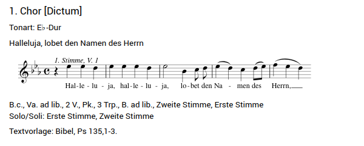

# Trieste, September 2025

<br><br>

## Schedule

### Saturday, September 13th

 
| Time slot | Topic |
| ------ | ------ |
| 9:00-11:30 |    Presentation of the thematic catalogues of Tartini, Elgar, Delius, Telemann, Schubert, (Bruckner?), and Grieg. |
| 11:30-12:00 | _Coffee break_ |
| 12:00-13:00 | Discussion of the preceding presentations|
| 13:00–14:00 | _Brunch at the Conservatory_ |
| 14:00–14:30 | MerMEId history|
| 14:30–15:00 | MerMEIding project and research data |
| 15:00–15:30 | The new MerMEId (1) |
| 15:30–16:00 | _Coffee break_ |
| 16:00-16:30 | The new MerMEId (2) |
| 16:30–17:30 | Discussion of the preceding presentations | 

### Sunday, September 14th

| Time slot | Topic |
| ------ | ------ |
| 9:00-9:30 | Git introduction for MerMEId users |
| 9:30-12:00 | Practical MerMEId workshop |

<br><br>

## Useful links and materials

### MerMEId and MEI

- Make your proposal for a name of the new MerMEId [here](https://app.wooclap.com/MDZRIL)! 
- [MEI](https://music-encoding.org/)
- [MerMEId](https://mermeid.edirom.de/index.html) (previous version)
- [MerMEId on GitHub](https://github.com/Edirom/MerMEId) (previous version)
- Join the Slack channel of the MerMEId community [here](https://join.slack.com/t/music-encoding/shared_invite/zt-3d5izuduu-b3PBpvV5yd91YJhN1q7GvA)! (The link will expire in 30 days.)

### W3C Documentation

- [RDF](https://www.w3.org/TR/rdf11-concepts/)
- [SHACL](https://www.w3.org/TR/shacl/)
- [Turtle](https://www.w3.org/TR/turtle/)

### Ontologies

- [Schema.org](https://schema.org/)
- [FRBRoo](https://erlangen-crm.org/efrbroo/)
- [LRMoo](https://cidoc-crm.org/lrmoo/si-uselearn-lrmoo)
- [CIDOC-CRM](https://cidoc-crm.org/html/cidoc_crm_v7.1.3.html)
- [DoReMus](https://data.doremus.org/ontology/)

### Code and data examples

- Single entities turtle examples:
    - [Example 1](downloads/774035217.ttl)
    - [Example 2](downloads/1110017576.ttl)
    - [Example 3](downloads/1763520500.ttl)
    - [Example 4](downloads/3852205663.ttl)

- Visualization of example entities
    - [Person](https://examples-ttl-to-html-f7aa2e.pages.gitlab.rlp.net/person-example.html)
    - [Place](https://examples-ttl-to-html-f7aa2e.pages.gitlab.rlp.net/place-example.html)
    - [Work](https://examples-ttl-to-html-f7aa2e.pages.gitlab.rlp.net/work-example.html)
    - [Expression](https://examples-ttl-to-html-f7aa2e.pages.gitlab.rlp.net/expression-example.html)

- SHACL-form examples
    - Demo: [SHACL Form Generator](https://ulb-darmstadt.github.io/shacl-form/#intro)
    - [Example 1](downloads/shacl1.shacl)
    - [Example 2](downloads/shacl2.shacl)
    - [Example 3](downloads/shacl3.shacl)
    - [Example 4](downloads/shacl4.shacl)
    - [Example 5](downloads/shacl5.shacl)

<br><br>

## Hands-on session

List of available test data repositories and credentials:

| Repository URL     | Token                                               | User          |
| :---               | :---                                                | :---          |
| [workshop-user1.git](https://gitlab.rlp.net/adwmainz/nfdi4culture/cdmd/project_templates/workshop-user1.git) | xxxxxxxxxxxxxxxxxxxxxxxxxxxxxxxxxxxxxxxxxxxxxxxx    | Carlo         |
| [workshop-user2.git](https://gitlab.rlp.net/adwmainz/nfdi4culture/cdmd/project_templates/workshop-user2.git) | xxxxxxxxxxxxxxxxxxxxxxxxxxxxxxxxxxxxxxxxxxxxxxxx    |  |
| [workshop-user3.git](https://gitlab.rlp.net/adwmainz/nfdi4culture/cdmd/project_templates/workshop-user3.git) | xxxxxxxxxxxxxxxxxxxxxxxxxxxxxxxxxxxxxxxxxxxxxxxx    |  |
| [workshop-user4.git](https://gitlab.rlp.net/adwmainz/nfdi4culture/cdmd/project_templates/workshop-user4.git) | xxxxxxxxxxxxxxxxxxxxxxxxxxxxxxxxxxxxxxxxxxxxxxxx    |  |
| [workshop-user5.git](https://gitlab.rlp.net/adwmainz/nfdi4culture/cdmd/project_templates/workshop-user5.git) | xxxxxxxxxxxxxxxxxxxxxxxxxxxxxxxxxxxxxxxxxxxxxxxx    |  |
| [workshop-user6.git](https://gitlab.rlp.net/adwmainz/nfdi4culture/cdmd/project_templates/workshop-user6.git) | xxxxxxxxxxxxxxxxxxxxxxxxxxxxxxxxxxxxxxxxxxxxxxxx    |  |
| [workshop-user7.git](https://gitlab.rlp.net/adwmainz/nfdi4culture/cdmd/project_templates/workshop-user7.git) | xxxxxxxxxxxxxxxxxxxxxxxxxxxxxxxxxxxxxxxxxxxxxxxx    |  |
| [workshop-user8.git](https://gitlab.rlp.net/adwmainz/nfdi4culture/cdmd/project_templates/workshop-user8.git) | xxxxxxxxxxxxxxxxxxxxxxxxxxxxxxxxxxxxxxxxxxxxxxxx    |  |
| [workshop-user9.git](https://gitlab.rlp.net/adwmainz/nfdi4culture/cdmd/project_templates/workshop-user9.git) | xxxxxxxxxxxxxxxxxxxxxxxxxxxxxxxxxxxxxxxxxxxxxxxx    |  |
| [workshop-user10.git](https://gitlab.rlp.net/adwmainz/nfdi4culture/cdmd/project_templates/workshop-user10.git) | xxxxxxxxxxxxxxxxxxxxxxxxxxxxxxxxxxxxxxxxxxxxxxxx    |  |
| [workshop-user11.git](https://gitlab.rlp.net/adwmainz/nfdi4culture/cdmd/project_templates/workshop-user11.git) | xxxxxxxxxxxxxxxxxxxxxxxxxxxxxxxxxxxxxxxxxxxxxxxx    |  |
| [workshop-user12.git](https://gitlab.rlp.net/adwmainz/nfdi4culture/cdmd/project_templates/workshop-user12.git) | xxxxxxxxxxxxxxxxxxxxxxxxxxxxxxxxxxxxxxxxxxxxxxxx    |  |
| [workshop-user13.git](https://gitlab.rlp.net/adwmainz/nfdi4culture/cdmd/project_templates/workshop-user13.git) | xxxxxxxxxxxxxxxxxxxxxxxxxxxxxxxxxxxxxxxxxxxxxxxx    |  |
| [workshop-user14.git](https://gitlab.rlp.net/adwmainz/nfdi4culture/cdmd/project_templates/workshop-user14.git) | xxxxxxxxxxxxxxxxxxxxxxxxxxxxxxxxxxxxxxxxxxxxxxxx    |  |
| [workshop-user15.git](https://gitlab.rlp.net/adwmainz/nfdi4culture/cdmd/project_templates/workshop-user15.git) | xxxxxxxxxxxxxxxxxxxxxxxxxxxxxxxxxxxxxxxxxxxxxxxx    |  |
| [workshop-user16.git](https://gitlab.rlp.net/adwmainz/nfdi4culture/cdmd/project_templates/workshop-user16.git) | xxxxxxxxxxxxxxxxxxxxxxxxxxxxxxxxxxxxxxxxxxxxxxxx    |  |
| [workshop-user17.git](https://gitlab.rlp.net/adwmainz/nfdi4culture/cdmd/project_templates/workshop-user17.git) | xxxxxxxxxxxxxxxxxxxxxxxxxxxxxxxxxxxxxxxxxxxxxxxx    |  |
| [workshop-user18.git](https://gitlab.rlp.net/adwmainz/nfdi4culture/cdmd/project_templates/workshop-user18.git) | xxxxxxxxxxxxxxxxxxxxxxxxxxxxxxxxxxxxxxxxxxxxxxxx    |  |
| [workshop-user19.git](https://gitlab.rlp.net/adwmainz/nfdi4culture/cdmd/project_templates/workshop-user19.git) | xxxxxxxxxxxxxxxxxxxxxxxxxxxxxxxxxxxxxxxxxxxxxxxx    |  |
| [workshop-user20.git](https://gitlab.rlp.net/adwmainz/nfdi4culture/cdmd/project_templates/workshop-user20.git) | xxxxxxxxxxxxxxxxxxxxxxxxxxxxxxxxxxxxxxxxxxxxxxxx    |  |


<br><br>

#### Part 1: Clone remote GitLab data repository

- Copy your data repository and credentials from the table above.
- Follow steps in *Getting Started* &rarr; *Adding a Repository*.

#### Part 2: Create a test entity and push it to the remote repository

- Follow steps in *Getting Started* &rarr; *Creating New Entities*. Choose a simple entity, like e.g. a _Person_ or a _Place_. Insert data in the form. Press the *Save* button.
- Follow steps in *Getting Started* &rarr; *Sharing Changes*.
- Optional: go to your remote GitLab repository and check if the entity is there.

#### Part 3: Create specific entities and connect them together

Create, save, and share the following entities using the information provided in the code snippets, descriptions, or screenshots. Feel free to enter additional information, if you want, to better explore the data model and the corresponding forms.
When an entity is shared (i.e. pushed to the remote repository) a GitLab pipeline is triggered to generate lists of entities (in Turtle format) published via GitLab Pages. It might be worthy to look at them to check the correspondence between IRIs and labels. Example list URL:  [https://adwmainz.pages.gitlab.rlp.net/nfdi4culture/cdmd/project_templates/workshop-user1/datasets/persons.ttl](https://adwmainz.pages.gitlab.rlp.net/nfdi4culture/cdmd/project_templates/workshop-user1/datasets/persons.ttl) (change repository name (*workshop-user1*) and entity name (*persons*) according to your purpose).


- **Entity 1**: **_Place_**, *Berlin*. Create a place entity for the city Berlin. Use the data provided in the XML snippet below.
```
<?xml version="1.0" encoding="UTF-8"?>
<place xml:id="urn:uuid:places/xxxxxxxxxx">
    <placeName>Berlin</placeName>
    <idno>https://www.geonames.org/2950159</idno>
</place>
```

- **Entity 2**: **_Person_**, *Georg Philipp Telemann*. Create a person entity for the composer Georg Philipp Telemann. Use the data provided in the Turtle snippet below.
```
<urn:uuid:xxxxxxxxxx> schema:familyName "Telemann";
    schema:givenName "Georg Philipp";
    owl:sameAs <http://d-nb.info/gnd/11862119X>;
    schema:gender "male";
    a melod:Person.
```

- **Entity 3**: **_Performance event_**. Create a performance event dated January 1st, 1751, in Hamburg. The description of the performance date is *Neujahr* (New Year's Day) and this date is known with *high* certainty. Be aware that the city *Hamburg* is not yet in the data set und you have first to create it. The entity *Hamburg* should appear in the drop-down lists shortly after beeing shared.

- **Entity 4**: **_Expression_** (component), *Chor [Dictum] ('Halleluja, lobet den Namen des Herrn')*. This is the first of seven movements of the expression *Halleluja, lobet den Namen des Herrn* (urn:uuid:2293419636). Insert the label *Chor [Dictum]* and specify the completion status as *Complete*. Than move to the *Music* section and encode music information taken from the screenshot below: Key, Meter, Instrumentation (choose *1., 2., B. ad lib., 3 Trp., Pk., 2 V., Va. ad lib., B.c*), PAE Incipit (@clef:G-2@keysig:bBEA@timesig:c@data:4-''EED/EEED/2E'4B''8CD/4EDC{8DE}/4FED) and text incipit.



- **Entity 5**: **_Expression_**, *Halleluja, lobet den Namen des Herrn*. Open the already existent main expression *urn:uuid:2293419636*, go to the field *Movements/Sections* in the *Music* section and add the expression component you just created before. Afterwards, add the performance created for January 1st, 1751, in Hamburg.

- **Entity 6**: **_Work_**, *Halleluja, lobet den Namen des Herrn*. Open the already existent work *urn:uuid:555068543*. Go to the section *Relations* and set the relation with the corresponding expression *urn:uuid:2293419636* as well as the relation *is part of* with the main work *Musicalisches Lob Gottes* (urn:uuid:1031334055).